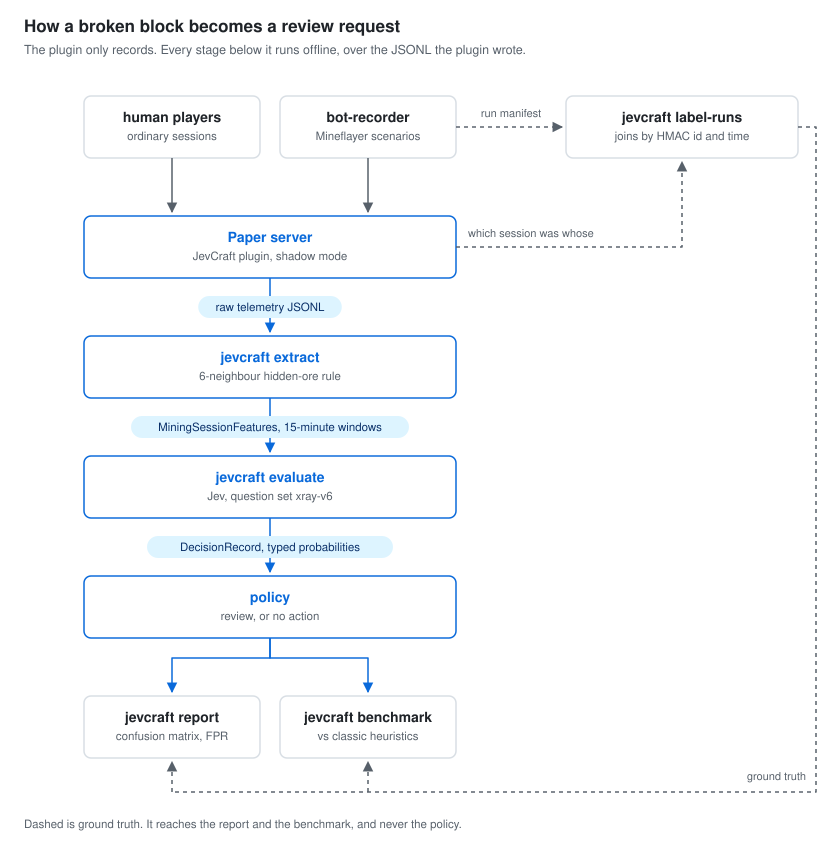
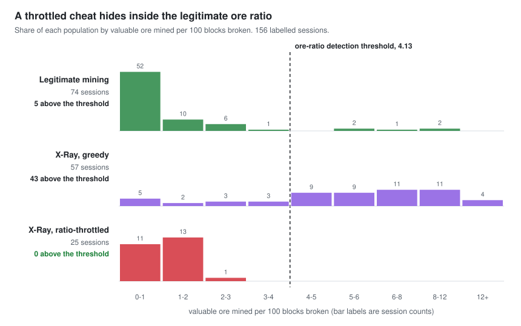
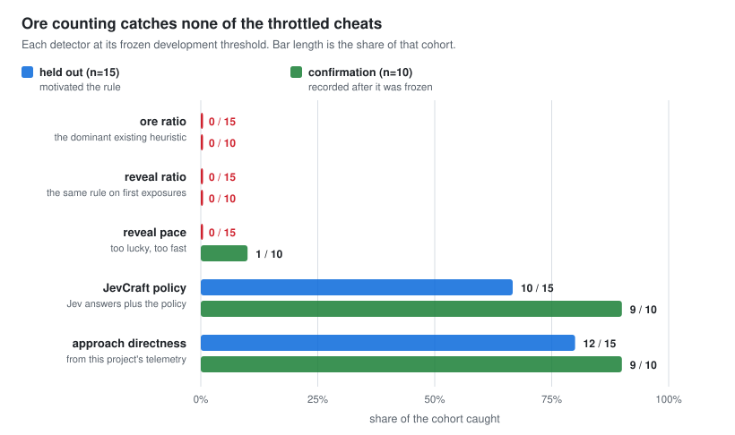
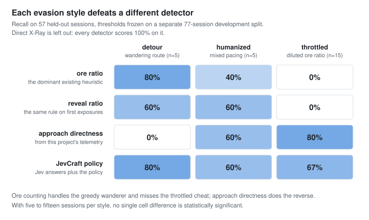

# JevCraft

[](https://github.com/nft-syou/jevcraft-bench/actions/workflows/ci.yml)
[](LICENSE)
[](.node-version)
[](plugin/)


**English** · [日本語](README.ja.md) · [简体中文](README.zh-CN.md) · [한국어](README.ko.md) · [Español](README.es.md)

Behavioral anti-cheat research bench for Minecraft (Paper) servers. Mining-session
telemetry is reduced to a small feature object, TypeSafe Jev answers a few typed
questions about it, and the results are scored offline against labelled sessions.

Labels are scenario assignments, not human judgements of observed cheating: a session counts as
X-Ray because the bot that produced it was running an X-Ray scenario, and as legitimate because a
legit scenario or a human player produced it. Nobody watched a recording and ruled on it.

This repository is a proof of concept. It **never** bans, kicks, or rolls back
players. The strongest outcome it produces is a request for human review.

## Status

Phases 0 to 3 are implemented: the offline slice, the Paper telemetry plugin, the feature
extractor, and real recordings on fixed-seed worlds. The corpus is **156 labelled sessions**
across two world seeds, from Mineflayer bots and one human player.



The plugin never calls the Jev API; evaluation is a separate offline step over the JSONL it
writes. See `docs/handoff/JevCraft_IMPLEMENTATION_HANDOFF.md` for the original spec and
`docs/evasion.md` for the current result.

**Running this on a server you actually operate:** `docs/deployment.md` has a four-step trial that
needs no clone, no Node and no API key. Install the jar, mine for fifteen minutes, then:

```bash
docker run --rm -v /srv/minecraft/plugins/JevCraft/data:/data:ro ghcr.io/nft-syou/jevcraft try /data
```

What you get is a recorder, not a detector. Nothing judges anything at runtime, there is no
alerting or review queue, and log files never rotate, so read that page before you leave it
running.

## Requirements

- Node.js 24 (`.node-version`)
- pnpm (version pinned in `package.json` `packageManager`)
- Optional: a TypeSafe API key in `TYPESAFE_API_KEY` for live evaluation

## Quick start

```bash
pnpm install
pnpm test
pnpm jevcraft evaluate datasets/fixtures/xray-direct-001.json
```

Without `TYPESAFE_API_KEY` the CLI uses a deterministic mock backend and says so on stderr.
Decisions are written to `datasets/decisions/<input>.jsonl` (ignored by Git).

### Live evaluation

```bash
cp .env.example .env   # then put your key in TYPESAFE_API_KEY
pnpm jevcraft evaluate datasets/fixtures --backend typesafe --out datasets/decisions/fixtures-live.jsonl
```

`pnpm jevcraft` loads `.env` if it exists (Node's `--env-file-if-exists`); an exported
`TYPESAFE_API_KEY` works too. The key is read only from the environment. Never commit it.

### Evaluation report

```bash
pnpm jevcraft evaluate datasets/fixtures --backend mock --out datasets/decisions/fixtures.jsonl
pnpm jevcraft report --decisions datasets/decisions/fixtures.jsonl --labels datasets/labels/fixtures.jsonl
```

Produces `reports/fixtures.md` with the confusion matrix, Precision / Recall / **FPR** / FNR / F1,
a threshold sweep over `P(likely_xray)`, per-subtype and per-confidence-band breakdowns,
latency percentiles, token totals, and the list of false positives and false negatives.

### More trials: repeats and synthetic sessions

```bash
# Same 5 fixtures, 10 times each, to measure Jev's answer variance
pnpm jevcraft evaluate datasets/fixtures --backend typesafe --repeat 10 --out datasets/decisions/fixtures-x10.jsonl

# 7 scenarios x 20 synthetic sessions (deterministic per seed), then evaluate and report
pnpm jevcraft generate scenarios --count 20 --seed 1   --out-features datasets/generated/seed1-features.jsonl --out-labels datasets/generated/seed1-labels.jsonl
pnpm jevcraft evaluate datasets/generated/seed1-features.jsonl --backend typesafe --out datasets/decisions/seed1.jsonl
pnpm jevcraft report --decisions datasets/decisions/seed1.jsonl --labels datasets/generated/seed1-labels.jsonl
```

The report then also contains a repeat-variance table and a sweep over `minEvidenceSufficiency`.
Archived results from real runs live in `docs/baselines/`.

## Paper plugin (Phase 2)

`plugin/` is a Paper server plugin that records, in shadow mode only:

- sampled movement (time / distance / rotation gates, with a 90 s ring buffer flushed when a session starts),
- block breaks inside a mining session,
- the first exposure of hidden valuable ores (6-neighbour rule, spec §7),
- mining-session boundaries (underground stone breaks or an ore reveal start one; idle timeout,
  logout, world change, far teleport, game-mode change, `/jevcraft flush` end one).

Everything goes to `plugins/JevCraft/data/<serverRunId>.jsonl` through a bounded queue and a
daemon writer thread; when the queue is full lines are dropped and counted, never blocking the
tick. Player ids are `hmac-sha256:<hex>` derived from `JEVCRAFT_HMAC_SECRET`; raw UUIDs and
names are never written. The plugin never bans, kicks, or rolls back.

> **The compose server is for an isolated bench, not for the internet.** It runs with
> `ONLINE_MODE: "false"`, so it never checks who is connecting, and it grants operator to 16
> fixed offline UUIDs so the recorder bots can teleport and fill. Anyone who can reach the port
> can join as `jevbotNN` and get those powers. It binds to `127.0.0.1` for that reason. Do not
> publish it on a public interface, and do not reuse this compose file for a real server.

**All JVM work runs in Docker; no JDK is installed on the host.**

```bash
pnpm plugin:test     # docker compose -f infra/docker-compose.yml run --rm gradle test
pnpm plugin:build    # ... gradle build  -> plugin/build/libs/JevCraft-<version>.jar
docker compose -f infra/docker-compose.yml up paper   # local Paper server with the jar mounted
```

Turn a server run into features and evaluate it:

```bash
pnpm jevcraft extract infra/paper/data/plugins/JevCraft/data --out datasets/features/run-001.jsonl
pnpm jevcraft evaluate datasets/features/run-001.jsonl --out datasets/decisions/run-001.jsonl
```

`extract` groups events by session, splits sessions longer than `--window-minutes` (default 15)
into `<sessionId>:w<n>` windows, and computes the spec §9 features: directness / detour ratio /
aim alignment from the 60 s of movement before each hidden-ore reveal, branch-mining likelihood
and tunnel directions from break geometry, cave exposure from open neighbour faces, break rhythm,
and trajectory coverage. Anything unobserved is `null`.

### Bot recordings (Phase 3 without humans)

`@jevcraft/bot-recorder` drives Mineflayer bots against the compose server to produce *real*
plugin telemetry at scale. An X-Ray bot is not a simulation: it reads ore positions from chunk
data it could never legitimately see, which is exactly what a cheating client does. The legit
bot only reacts to blocks with an open face.

```bash
docker compose -f infra/docker-compose.yml up -d paper       # fixed seed, peaceful, bots are ops
JEVCRAFT_HMAC_SECRET=change-me-local-only   pnpm jevcraft record --scenario all --count 5 --budget-seconds 240 --out datasets/recordings/batch1.jsonl
pnpm jevcraft extract infra/paper/data/plugins/JevCraft/data --out datasets/features/batch1.jsonl
pnpm jevcraft label-runs --raw infra/paper/data/plugins/JevCraft/data --manifest datasets/recordings/batch1.jsonl --out datasets/labels/batch1.jsonl
# optional: efficiency.baselinePercentile against the legit sessions you already have
pnpm jevcraft baseline --features datasets/features/batch1.jsonl --labels datasets/labels/batch1.jsonl --out datasets/baselines/legit.json
pnpm jevcraft extract infra/paper/data/plugins/JevCraft/data --baseline datasets/baselines/legit.json --out datasets/features/batch1.jsonl
pnpm jevcraft evaluate datasets/features/batch1.jsonl --out datasets/decisions/batch1.jsonl
pnpm jevcraft report --decisions datasets/decisions/batch1.jsonl --labels datasets/labels/batch1.jsonl
```

Scenarios: `legit-branch-mining`, `xray-direct`, `xray-detour`, `xray-humanized`,
`xray-throttled` (`packages/bot-recorder/src/scenarios.ts`). The last one holds its ore ratio
inside the legitimate range on purpose; see `docs/evasion.md`.

Each run joins as `jevbotNN`, teleports to a fresh
64-block cell, mines for the budget, and leaves; the manifest records the bot's pseudonymous id
(same HMAC as the plugin, computed from the offline UUID and the secret) and the time window, so
`label-runs` can attach ground truth to the plugin's sessions without the plugin ever writing names.
Mineflayer speaks protocol 26.1; the server runs ViaVersion + ViaBackwards so it can join 26.2.

Another world: `JEVCRAFT_SEED=jevcraft-arena-2 JEVCRAFT_LEVEL=arena2 docker compose -f infra/docker-compose.yml up -d paper`
(the seed only applies when a level folder is first created). `scripts/session-table.mjs` and
`scripts/gate-sweep.mjs` print per-session tables and sweep the approach gate over archived
decisions without API calls.

Bots move and look more regularly than people (`--human-noise` softens this). Treat bot data as
the bulk set for wiring, extractor and threshold work, and keep a small human-played set for the
final false-positive check (handoff spec §22).

Admin commands (`jevcraft.admin`, default op): `/jevcraft status`, `/jevcraft session <player>`,
`/jevcraft flush <player>`, `/jevcraft metrics`. Config: `plugin/src/main/resources/config.yml`.
The JSONL line format is mirrored by `RawTelemetryEventSchema` in `@jevcraft/schema`, and
`datasets/fixtures/raw/sample.jsonl` (written by the plugin's MockBukkit test) is validated by it.

Deviations from the handoff spec, recorded in `docs/superpowers/plans/2026-09-19-paper-telemetry-plugin.md`:
Paper `26.2.build.124-stable` requires Java 25 (spec said 21), and commands are declared in
`plugin.yml` rather than `paper-plugin.yml`.

## Benchmark against existing heuristics

`jevcraft benchmark` runs the heuristics existing anti-X-Ray tooling relies on (ore ratio, reveal
ratio, efficiency percentile, reveal pace, straight-line approach, a hand-written combination and
a logistic regression fitted on the development split) against JevCraft on the same labelled
sessions, at the same false-positive ceiling, using archived Jev answers only.

`datasets/splits2/` is committed, so this runs from a fresh clone with no server, no recordings
and no API key:

```bash
pnpm jevcraft benchmark   --features datasets/splits2/holdout-features.jsonl   --labels   datasets/splits2/holdout-labels.jsonl   --decisions datasets/splits2/holdout-decisions.jsonl   --dev-features datasets/splits2/dev-features.jsonl   --dev-labels   datasets/splits2/dev-labels.jsonl   --dev-decisions datasets/splits2/dev-decisions.jsonl   --max-fpr 0.072 --out reports/benchmark-evasive.md
```

Those splits hold 134 of the 156 sessions: 77 development and 57 held out. The remaining 22 are
the confirmation set, which is scored separately in `docs/evasion.md` and deliberately kept out of
this benchmark. `scripts/make-splits.mjs` rebuilds the splits from a full feature and decision
set, which only someone who has run the recorder will have.

Thresholds are chosen on the development split and frozen; without `--dev-*` the report says in
its header that its numbers describe fit rather than generalisation.

Against greedy X-Ray bots there is no advantage: counting ore already solves that case. The
interesting case is a cheater who keeps their numbers ordinary. `xray-throttled` is that cheater.
It reads ore positions from chunk data like the other X-Ray bots, then digs plain tunnel between
targets until its ore ratio falls back inside the legitimate range.



It works. Not one of the 25 throttled sessions reaches the ore-ratio threshold, and they occupy a
narrower band than legitimate mining does, so no cut-off separates them without flagging ordinary
players too. What the cheat cannot hide is the walk to the ore.



The held-out 15 are the sessions that motivated the policy's approach rule, so they cannot
confirm it. The 10 confirmation sessions were recorded after that rule was frozen.

That is one evasion, not evasion in general. Wandering on the way to ore you already know about
defeats the approach rule just as completely as diluting the ratio defeats counting:



So the contribution is the approach telemetry, not the language model: a hand-written directness
rule does as well as Jev on this data. See `docs/evasion.md` for the full result, including how
much of it was pre-registered, and `docs/benchmark.md` for the method.

## Operating cost

Measured over 156 live evaluations (`xray-v6`, `jev-1.13.0`): **1,402 input tokens and 137 output
tokens per session window**, with a spread of under 3%. TypeSafe bills input only, at $0.042 per
million tokens, and output is free, so one judged window costs **$0.000059**, or about 17,000
judged windows per dollar.

Call volume follows underground mining time rather than player count. The plugin opens a session
after 10 stone breaks at or below y=40 or on any target-ore reveal, closes it after 120 s idle, and
the extractor cuts it into 15-minute windows. The one human player recorded so far produced 11
windows in 66 minutes of mining, so roughly **10 windows per player-hour of mining**. That single
82-minute sample is the weakest number in the estimate and it scales the whole table linearly.

Monthly cost **as the code behaves today**, which sends every window. `evaluate-session.ts` calls
the backend first and only then applies the policy, so `enoughEvidence` decides the outcome but
saves nothing; a session with no usable evidence is still paid for.

| Server profile | Player-hours/month | 25% underground | 50% underground | Per year at 50% |
| --- | --- | --- | --- | --- |
| Friends only, 4 players for 4 h/day | 480 | $0.07 | $0.14 | $1.70 |
| Small public, 5 average concurrent | 3,650 | $0.54 | $1.07 | $13 |
| Small public, 10 average concurrent | 7,300 | $1.07 | $2.15 | $26 |
| Busy, 30 average concurrent | 21,900 | $3.22 | $6.45 | $77 |
| Large, 100 average concurrent | 73,000 | $11 | $21 | $258 |

The cost is recurring and metered, and it tracks player activity, so it cannot be capped in
advance. The X-Ray countermeasures servers use today are not metered: Paper ships anti-X-Ray
obfuscation in the box, Orebfuscator is open source, and the established behavioural anti-cheat
plugins are free or a one-time purchase.

Because output is free, reducing cost means cutting calls or shortening the prompt. Neither
reduction is implemented. At 100 average concurrent and 25% underground, what each would be worth:

| | Monthly |
| --- | --- |
| every window, as it works today | $11 |
| skipping windows that already fail `enoughEvidence` locally, 16% of them | $9.03 |
| plus a pre-filter on directness and ore ratio, keeping 59 of 59 detections on the 134-session set | $6.77 |
| every window, evaluated three times to damp answer variance | $32 |

## Packages

| Package | Responsibility |
| --- | --- |
| `@jevcraft/schema` | Zod contracts: `MiningSessionFeatures`, `DecisionRecord`, `SessionLabel` |
| `@jevcraft/jev-evaluator` | `xray-v1` question set, TypeSafe SDK backend, mock backend, decision policy |
| `@jevcraft/eval-runner` | Label join, metrics, Markdown report |
| `@jevcraft/feature-extractor` | Raw plugin JSONL -> `MiningSessionFeatures` (spec §9 definitions; 15-min windows) |
| `@jevcraft/scenario-generator` | Feature-level synthetic sessions from `scenarios/*.json` (spec §13A) |
| `@jevcraft/bot-recorder` | Mineflayer bots that play legit / X-Ray scenarios on the compose server (spec §13B) |
| `@jevcraft/cli` | `pnpm jevcraft try` / `extract` / `evaluate` / `report` / `generate` / `record` / `label-runs` |

## How a session is judged

One request per mining session. Jev is asked five independent questions:

| Key | Type | Meaning |
| --- | --- | --- |
| `behavior_class` | choice | `legit` / `suspicious` / `likely_xray` / `insufficient_evidence` with a full probability distribution and a confidence |
| `hidden_information_use` | noul | P(player acted on hidden ore-location information) |
| `route_naturalness` | score 0..4 | 0 = highly unnatural, 4 = strongly natural (`normalized = score / 4`) |
| `evidence_sufficiency` | noul | P(enough evidence to classify) |
| `approach_targeting` (v6+) | noul | P(movement before reveals was a deliberate approach, judged from `hiddenOreApproach` only) |

Question sets are versioned (`--questions xray-v1` … `xray-v6`, default v6) and the version is
stored on every decision record, so sets can be compared on the same dataset. See
`docs/baselines/README.md` for how each version was chosen.

The policy (`packages/jev-evaluator/src/policy.ts`) turns these into
`insufficient_evidence` / `high_priority_review` / `review` / `no_action`. `jevcraft repolicy`
rewrites archived decisions under different thresholds and records what it applied in a
`.meta.json` beside its output. `confidence` is a statistic of the distribution shape and is not
`P(likely_xray)`.

Thresholds come from the 77-session development split, with one exception that matters:
`reviewApproachTargetingAlone = 0.35` was added after the sessions it was first measured on had
already been scored. Its effect there is a hypothesis, not a measurement. A 22-session set
recorded after the rule was frozen gives 9 of 10 caught against 3 of 10 without it.
`docs/evasion.md` has the timeline and the before-and-after.

## Data hygiene

- Missing values are `null`, never `0`.
- Player ids must be pseudonymous. No real UUIDs, names, chat, or IPs in any dataset.
- `datasets/private/`, `datasets/decisions/`, and `reports/` are ignored by Git.
- Fixtures under `datasets/fixtures` test the wiring; they are not proof of accuracy.

## Development

```bash
pnpm check            # lint + typecheck + test
pnpm format           # apply Biome formatting
pnpm figures          # redraw docs/images/*.svg from docs/figure-data.json
pnpm figures:refresh  # recompute those aggregates from the datasets first
```

CI runs the same commands plus a mock evaluation, and re-renders the figures. That step fails if
the committed SVGs have drifted from the committed aggregates, if the corpus size stated in any
`README*.md` no longer matches the data, or if a language bar links to a translation that does not
exist. Live Jev calls are never made in CI.

Figures are generated, never hand-edited. The session-level datasets are gitignored, so
`scripts/make-figures.mjs` keeps its inputs in `docs/figure-data.json`, which is committed and is
the only thing CI needs.

## Project files

| File | What it is for |
| --- | --- |
| `CONTRIBUTING.md` | How to open a change, and the rules a change has to follow |
| `CODE_OF_CONDUCT.md` | Community standards, plus the no-working-cheats and no-player-data rules |
| `SECURITY.md` | How to report a vulnerability or a privacy problem privately |
| `CHANGELOG.md` | What changed, and which claims were withdrawn and why |
| `CITATION.cff` | How to cite this bench |
| `docs/deployment.md` | Installing the plugin on a live server, and what it will and will not do |
| `Dockerfile` | The analysis CLI as an image, so a trial needs no Node install |

## License

MIT. See `LICENSE`.
