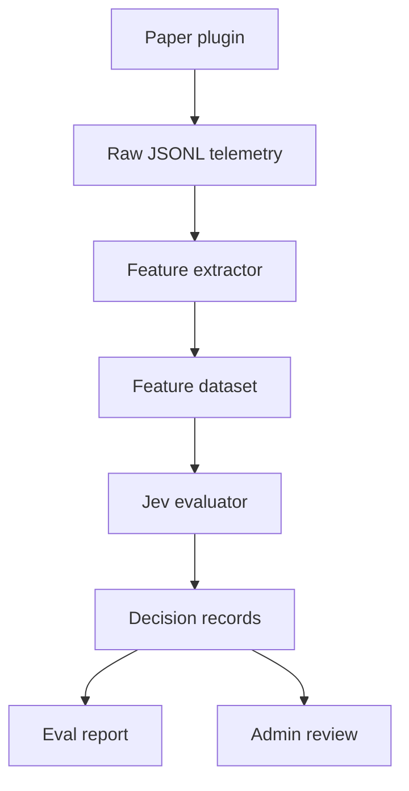

# JevCraft 実装引き継ぎ資料

更新日: 2026-09-18  
対象: Minecraft Java Edition / Paper サーバー  
作業名: `jevcraft`  
初期ユースケース: X-Ray利用らしい採掘行動の検知

## 1. このプロジェクトの目的

JevCraftは、Minecraftサーバー上のプレイヤー行動を収集・特徴量化し、TypeSafe Jevで「隠れた鉱石位置を知っているような行動か」を確率付きで判定する、サーバー管理者向けのBehavioral Anti-Cheat実験基盤である。

初期版の目的は、チーターを自動BANすることではない。次の仮説を、再現可能なデータと評価指標で検証することが目的である。

> 通常のルール判定だけでは表現しにくい採掘経路の不自然さを、Jevの構造化された確率判断で補助できるか。

## 2. 最初に固定するスコープ

### 対象

- Minecraft Java Edition
- Paperサーバー
- Java 21
- サーバーサイドプラグイン
- X-Rayによる鉱石探索の行動検知
- オフライン評価CLI
- shadow modeでの実サーバー検証

### 対象外

- 自動BAN、自動kick、自動ロールバック
- クライアント改変の直接検出
- EACのような端末監視
- KillAura、AimAssist、AutoClicker等の同時実装
- Bedrock Edition
- 複数ゲーム対応
- 最初からの大規模Webダッシュボード
- Jev単発結果だけによる処分

## 3. 成功条件

PoC完了条件は次のとおり。

1. Paperプラグインが採掘イベントと直前の移動・視線履歴をJSONLに保存できる。
2. 隠れていた鉱石が初めて露出した瞬間を検出できる。
3. 1回の採掘セッションを、Jevへ渡せる小さな特徴量オブジェクトへ変換できる。
4. 同一データセットを何度でもオフライン評価できる。
5. `legit / suspicious / likely_xray / insufficient_evidence` の確率分布と補助判断を保存できる。
6. ラベル付きデータから混同行列、Precision、Recall、FPRを出せる。
7. 実サーバーでは管理者確認だけを行い、自動処分を行わない。

目標値は最初から固定しすぎない。最初の現実的なゲートは以下とする。

- 正常セッション100件以上
- 疑似X-Rayセッション100件以上
- 同一データで再実行可能
- APIエラー時にゲーム進行へ影響しない
- Paperメインスレッド上で外部API通信をしない
- FPRを主要指標として記録できる

## 4. 基本設計



### 責務分離

| コンポーネント | 言語 | 責務 |
| --- | --- | --- |
| Paper plugin | Java 21 | イベント収集、短期リングバッファ、鉱石露出検出、非同期ファイル出力 |
| Feature extractor | TypeScript | 生イベントを採掘セッションへ集約し、決定論的な特徴量を計算 |
| Jev evaluator | TypeScript | TypeSafe API呼び出し、リトライ、結果保存 |
| Eval runner | TypeScript | 正解ラベルとの比較、閾値別評価、レポート生成 |
| Scenario generator | TypeScript | 合法・露骨・回避型の合成特徴量または経路シナリオを生成 |

重要な原則は、Jevへ生の全tickログを送らないこと。ゲーム固有の正確な計算はコードで行い、Jevには判断に必要な圧縮済み状態だけを渡す。

## 5. 推奨リポジトリ構成

```text
jevcraft/
  README.md
  LICENSE
  CONTRIBUTING.md
  SECURITY.md
  .env.example
  .gitignore
  pnpm-workspace.yaml
  package.json

  plugin/
    build.gradle.kts
    settings.gradle.kts
    src/main/java/dev/jevcraft/plugin/
      JevCraftPlugin.java
      listener/
      telemetry/
      session/
      command/
    src/main/resources/
      paper-plugin.yml
      config.yml

  packages/
    schema/
      src/raw-event.ts
      src/features.ts
      src/decision.ts
    feature-extractor/
      src/
      test/
    jev-evaluator/
      src/
      test/
    eval-runner/
      src/
      test/
    scenario-generator/
      src/
      test/

  datasets/
    README.md
    fixtures/
    labels.example.jsonl

  scenarios/
    legit/
    blatant-xray/
    evasive-xray/

  docs/
    architecture.md
    telemetry.md
    labeling-guide.md
    eval-methodology.md

  infra/
    docker-compose.yml
    paper/

  reports/
    .gitkeep
```

`datasets/private/`、実プレイヤーのUUID、API応答の未加工ログ、APIキーはGitへ入れない。

## 6. 実装順序

最初からMinecraft内の完全な自動操作を作らない。以下の順序で進める。

### Phase 0: リポジトリ基盤

- monorepoを作る
- TypeScriptはpnpm workspace
- JavaはGradle Wrapper
- JSON SchemaまたはZodでデータ契約を固定
- formatter、lint、unit test、GitHub Actionsを追加
- `TYPESAFE_API_KEY` は環境変数だけで受ける

### Phase 1: オフライン縦切り

- 手書きfixtureを10〜20件作成
- Feature schemaを確定
- Jev evaluatorを実装
- 結果JSONLを保存
- Eval runnerで混同行列を出す

この段階ではPaperサーバーを起動しなくてもよい。まず「特徴量 → Jev → 評価」が通ることを確認する。

### Phase 2: Paper telemetry

- `BlockBreakEvent`
- `PlayerMoveEvent`の間引き記録
- `PlayerQuitEvent`、teleport、world change
- 隠れた鉱石の初回露出判定
- 採掘セッション境界
- JSONL非同期writer

### Phase 3: 実データとラベル

- 固定seedのテストワールドを用意
- 合法採掘を人手で収録
- 鉱石座標を知ったテスト担当が疑似X-Ray経路を収録
- 管理者がラベル付け
- fixtureと実データを分離して評価

### Phase 4: Scenario generator

- 直進率
- detour量
- 人間らしいノイズ
- 採掘間隔のばらつき
- 偶然の連続発見
- cave mining / branch mining

をパラメータ化し、検知限界を探索する。

### Phase 5: shadow mode

- 実サーバーへ導入
- 管理者だけが結果を閲覧
- 判定と人間ラベルの差を蓄積
- 自動処分は実装しない

## 7. Paperプラグイン仕様

### 収集対象

#### 移動スナップショット

全tick保存は避け、次のいずれかを満たした時だけ保存する。

- 100〜200ms経過
- 位置が一定距離以上変化
- yaw/pitchが一定角度以上変化
- block break直前

保持期間はまず90秒のリングバッファとする。

#### Block break

- timestamp
- player pseudonymous id
- world id
- block coordinate
- material
- tool category
- game mode
- light level
- surrounding block summary
- session id

#### Hidden ore reveal

ブロックが破壊される直前に、その6近傍を確認する。隣接鉱石が他の面から空気・洞窟・透過ブロックへ露出しておらず、今回の破壊によって初めて見えるなら `hidden_ore_reveal` を発生させる。

対象鉱石は設定可能にする。初期値は次でよい。

- diamond ore / deepslate diamond ore
- ancient debris
- emerald ore / deepslate emerald ore

鉄や石炭は頻度が高く、PoCの信号を薄めるため初期対象外とする。

### セッション境界

採掘セッション開始候補:

- 石系ブロックを地下で一定数破壊
- 対象鉱石を露出または破壊

終了条件:

- 最後の採掘から120秒経過
- logout
- world change
- teleportで大きく移動
- game mode変更
- 管理者コマンドでflush

### スレッド方針

- Bukkit/Paper APIによるworld参照は原則メインスレッド内で完了させる。
- API通信、JSONL書き込み、圧縮、レポート生成はメインスレッド外で行う。
- queueが満杯ならゲームを止めず、drop数をメトリクスへ記録する。
- 外部API障害時はfail-openとし、プレイヤーへ影響させない。

## 8. Raw telemetry schema案

```json
{
  "schemaVersion": 1,
  "eventId": "01K...",
  "eventType": "hidden_ore_reveal",
  "occurredAt": "2026-09-18T12:34:56.789Z",
  "serverRunId": "run_...",
  "sessionId": "session_...",
  "playerId": "hmac-sha256:...",
  "world": "world",
  "position": { "x": 120, "y": -52, "z": -34 },
  "revealedOre": {
    "material": "DEEPSLATE_DIAMOND_ORE",
    "x": 121,
    "y": -52,
    "z": -34,
    "previouslyVisible": false
  },
  "context": {
    "gameMode": "SURVIVAL",
    "tool": "DIAMOND_PICKAXE",
    "lightLevel": 0,
    "naturalWorldAssumed": true
  }
}
```

実UUIDをそのまま保存しない。サーバーごとの秘密saltを使ったHMAC識別子にする。評価用データセットへ出す際はさらに別IDへ変換する。

## 9. Feature schema案

1リクエストは原則1採掘セッションとする。長時間セッションは5〜15分窓へ分割し、窓同士の関連はコード側で保持する。

```json
{
  "schemaVersion": 1,
  "featureExtractorVersion": "0.1.0",
  "session": {
    "durationSec": 603,
    "movementDistance": 311.4,
    "blocksBroken": 428,
    "valuableOreReveals": 31,
    "valuableOreBlocksBroken": 34
  },
  "exploration": {
    "branchMiningLikelihood": 0.18,
    "caveExposureRatio": 0.07,
    "uniqueTunnelDirections": 6,
    "turnCount": 34
  },
  "hiddenOreApproach": {
    "sampleCount": 28,
    "meanDirectness": 0.89,
    "medianDetourRatio": 1.12,
    "aimAlignmentBeforeRevealRatio": 0.76,
    "turnsTowardHiddenOre": 17,
    "directionChangesNearOre": 27
  },
  "timing": {
    "meanBreakIntervalMs": 438,
    "breakIntervalStdDevMs": 143,
    "medianSecondsBetweenReveals": 13.2
  },
  "efficiency": {
    "valuableOrePer100Blocks": 7.24,
    "nonOreBlocksPerHiddenReveal": 12.8,
    "baselinePercentile": 99.4
  },
  "quality": {
    "trajectoryCoverage": 0.96,
    "droppedEventCount": 0,
    "enoughEvidence": true,
    "knownConfounders": []
  }
}
```

### 特徴量の定義

- `directness`: 直線距離 ÷ 実際の採掘経路長。1に近いほど直進。
- `detourRatio`: 実際の採掘経路長 ÷ 直線距離。1に近いほど最短。
- `aimAlignmentBeforeRevealRatio`: 鉱石が未露出の期間に、視線または進行方向が鉱石方向へ一定角以内だった割合。
- `turnsTowardHiddenOre`: 未露出鉱石への角度誤差を大きく減らした方向転換数。
- `caveExposureRatio`: 採掘経路のうち、既存空間・洞窟に接していた割合。
- `baselinePercentile`: 同一ワールド条件・高さ帯・採掘法における効率順位。ベースライン未作成時はnull。

数値の正規化、ゼロ除算、欠損値の意味をschemaとテストで固定する。値がない場合に0で埋めると「観測した結果ゼロ」と区別できないため、原則nullを使う。

## 10. Jev判定設計

JevのChoice、Noul、Scoreは1回のAPI呼び出しで並列に質問できる。1個の大きな質問に全判断を詰め込まず、独立した判断へ分解する。

### リクエスト案

```json
{
  "model": "jev-latest",
  "state": {
    "task": "Evaluate a Minecraft mining session for behavioral evidence of hidden ore knowledge.",
    "importantContext": [
      "High skill and high efficiency alone are not cheating.",
      "Cave exposure and branch-mining patterns can legitimately produce ore streaks.",
      "Judge only from the supplied observations.",
      "Insufficient telemetry must remain insufficient evidence."
    ],
    "features": "<MiningSessionFeatures>"
  },
  "questions": {
    "behavior_class": {
      "type": "choice",
      "instructions": "Which class best describes this mining session?",
      "criteria": {
        "legit": "Consistent with ordinary exploration, cave mining, branch mining, or plausible luck.",
        "suspicious": "Contains meaningful anomalies but not enough evidence for likely hidden ore knowledge.",
        "likely_xray": "Strongly consistent with acting on locations of ores that were not yet legitimately visible.",
        "insufficient_evidence": "Telemetry quantity or quality is too weak for a reliable classification."
      }
    },
    "hidden_information_use": {
      "type": "noul",
      "instructions": "Does the path provide evidence that the player acted on hidden ore-location information?",
      "criteria": {
        "true": "Repeated pre-reveal movement, turning, or tunneling is unusually targeted toward hidden valuable ores.",
        "false": "The route is plausibly explained by visible terrain, ordinary mining patterns, chance, or insufficient data."
      }
    },
    "route_naturalness": {
      "type": "score",
      "instructions": "How natural is the route for legitimate mining?",
      "criteria": [
        "Highly unnatural and repeatedly target-directed",
        "Noticeably unnatural",
        "Ambiguous or mixed",
        "Mostly natural",
        "Strongly consistent with legitimate mining"
      ]
    },
    "evidence_sufficiency": {
      "type": "noul",
      "instructions": "Is there enough high-quality behavioral evidence to classify this session?"
    }
  }
}
```

TypeSafe API endpointは `POST https://api.typesafe.ai/v1/systemone`。実装時は公式JavaScript/TypeScript SDK `@typesafe-ai/sdk` を優先し、SDKで不足する場合だけHTTPを直接使う。公式SDKはNode.js 20以上を要求するため、本リポジトリはNode.js 24系で固定する。

### コード側のポリシー

Jevの `choice` だけを使わず、確率分布とデータ品質を必ず保存する。初期ポリシー例:

```text
if quality.enoughEvidence == false:
    outcome = insufficient_evidence
else if evidence_sufficiency.noul < 0.65:
    outcome = insufficient_evidence
else if P(likely_xray) >= 0.90
        and hidden_information_use.noul >= 0.85
        and behavior_class.confidence >= 0.60:
    outcome = high_priority_review
else if P(likely_xray) + P(suspicious) >= 0.75:
    outcome = review
else:
    outcome = no_action
```

この閾値は仮置きであり、ラベル付きデータから調整する。`confidence`は正解確率そのものではなく、Choice/Scoreの分布形状から得られる確信度なので、`P(likely_xray)`と混同しない。

## 11. Decision record schema案

```json
{
  "schemaVersion": 1,
  "evaluationId": "eval_...",
  "sessionId": "session_...",
  "evaluatedAt": "2026-09-18T12:40:00Z",
  "model": "jev-latest",
  "questionSetVersion": "xray-v1",
  "featureExtractorVersion": "0.1.0",
  "answers": {
    "behaviorClass": {
      "choice": "likely_xray",
      "probabilities": {
        "legit": 0.03,
        "suspicious": 0.15,
        "likely_xray": 0.80,
        "insufficient_evidence": 0.02
      },
      "confidence": 0.72
    },
    "hiddenInformationUse": 0.88,
    "routeNaturalness": 0.9,
    "evidenceSufficiency": 0.96
  },
  "policyOutcome": "review",
  "latencyMs": 143,
  "error": null
}
```

モデル別比較ができるよう、`model`、question set、feature extractorの各バージョンを必ず残す。

## 12. ラベル設計

### Ground truth label

```text
legit
simulated_xray
known_cheat
unknown
```

### 行動サブタイプ

```text
branch_mining
cave_mining
lucky_streak
direct_xray
detour_xray
humanized_xray
mixed
```

### レビュアー状態

```text
unreviewed
single_review
double_review_agree
double_review_disagree
```

`suspicious`はモデル出力であり、Ground truthとして使わない。教師側で曖昧なものは `unknown` として主要なPrecision/Recall計算から外し、別に件数を報告する。

## 13. Scenario generator

2種類に分ける。

### A. Feature-level generator

Minecraftを起動せず、Feature schemaに従う合成データを作る。API結線、question set、閾値、レポート処理のテスト用であり、精度の最終証明には使わない。

```yaml
name: evasive-xray-medium-noise
label: simulated_xray
parameters:
  hiddenOreReveals: 18
  directnessMean: 0.72
  detourRatioMean: 1.45
  aimAlignmentRatio: 0.55
  humanNoise: 0.35
  caveExposureRatio: 0.08
  quality: 0.95
expected:
  likelyXrayProbabilityMin: 0.55
```

### B. Game-level scenario

固定seedまたは専用arenaで人間・botが実際に採掘し、Paper pluginからraw telemetryを得る。こちらを最終評価へ使う。

最低限のシナリオ:

1. 普通のbranch mining
2. 普通のcave exploration
3. 偶然の連続発見
4. 鉱石座標へ最短掘削
5. 鉱石直前で1回曲がる
6. 複数回detourする
7. 低価値鉱石も混ぜて掘るhumanized X-Ray
8. 長時間の通常採掘中に短い疑わしい区間だけ存在

## 14. Eval runner

### CLI案

```bash
pnpm jevcraft extract datasets/raw/run-001.jsonl \
  --out datasets/features/run-001.jsonl

pnpm jevcraft evaluate datasets/features/run-001.jsonl \
  --questions xray-v1 \
  --out datasets/decisions/run-001.jsonl

pnpm jevcraft report \
  --features datasets/features/run-001.jsonl \
  --decisions datasets/decisions/run-001.jsonl \
  --labels datasets/labels/run-001.jsonl \
  --out reports/run-001.md
```

### 必須メトリクス

- confusion matrix
- Precision
- Recall / TPR
- False Positive Rate
- False Negative Rate
- F1
- threshold別の各値
- シナリオ種別ごとの成績
- confidence帯ごとのaccuracy
- API latency p50 / p95 / p99
- input tokensと推定コスト
- `insufficient_evidence`率

最重要指標はFPR。アンチチートは、上手い人や運の良い人を誤検知すると運用上の信用を失う。

## 15. Replayの扱い

初期PoCでは完全なpacket replayを必須にしない。raw telemetryとfeature datasetを固定すれば、Jev・question set・閾値の比較は何度でも再実行できる。

実際のクライアント挙動をPaperへ再投入する段階では、`smashyalts/mcbenchmark`を調査対象とする。同プロジェクトにはPaper capture plugin、trace compiler、headless replay、scenario出力、合成fixture生成がある。ただし主目的は負荷ベンチマークであり、JevCraftへ直接組み込む前に次を確認する。

- ライセンス
- 対象Minecraft/Paperプロトコル
- block digと移動の再現精度
- ore reveal用テストワールドとの整合
- Git submodule、fork、外部dev toolのどれで使うか

Iustitiaのlive self-testは、`legit / cheat / replay`を分けるテスト設計の参考資料として扱う。Iustitia本体はFabricクライアント側アンチチートなので、JevCraftのサーバープラグインへ直接依存させない。

## 16. 管理コマンド案

```text
/jevcraft status
/jevcraft session <player>
/jevcraft flush <player>
/jevcraft review <player>
/jevcraft label <session-id> <legit|simulated_xray|known_cheat|unknown>
/jevcraft export <session-id>
/jevcraft metrics
```

権限例:

```text
jevcraft.admin
jevcraft.review
jevcraft.export
```

チャットへリアルタイムで断定表示せず、`review`または`high_priority_review`として管理者だけに表示する。

## 17. 設定案

```yaml
mode: shadow

telemetry:
  enabled: true
  movementSampleMs: 150
  trajectoryBufferSeconds: 90
  sessionIdleTimeoutSeconds: 120
  outputDirectory: plugins/JevCraft/data
  queueCapacity: 10000

ores:
  - DIAMOND_ORE
  - DEEPSLATE_DIAMOND_ORE
  - ANCIENT_DEBRIS
  - EMERALD_ORE
  - DEEPSLATE_EMERALD_ORE

privacy:
  hmacSecretEnvironmentVariable: JEVCRAFT_HMAC_SECRET
  includePlayerName: false

evaluation:
  enabled: false
  endpoint: https://api.typesafe.ai/v1/systemone
  model: jev-latest
  apiKeyEnvironmentVariable: TYPESAFE_API_KEY
  questionSet: xray-v1
  requestTimeoutMs: 5000
```

PoCでは、プラグインから直接Jev APIを呼ばず、まずオフラインCLIで評価する。live evaluationを追加する場合も、ローカルsidecarまたは非同期worker経由を優先する。

## 18. テスト方針

### Unit test

- 隠れた鉱石の6面判定
- 既に洞窟へ露出した鉱石の除外
- 複数鉱石veinの重複除外
- session timeout
- teleport/world changeでの分割
- directness、detour ratio、角度差の計算
- nullと0の区別
- schema version不一致
- decision policyの境界値

### Integration test

- Paperテストサーバー起動
- plugin load
- synthetic playerまたは手動操作でblock break
- JSONL生成
- extractor実行
- Jev APIはmock serverで置換
- decision保存

### Live eval

- APIキーがある環境だけで実施
- CIではデフォルト無効
- response snapshotを固定しすぎない
- schema、選択肢、確率範囲、エラーハンドリングを検証

## 19. 最初のIssue一覧

### Epic 1: Offline evaluation vertical slice

1. `chore: initialize monorepo and CI`
2. `feat(schema): define mining feature and decision schemas`
3. `feat(evaluator): add TypeSafe Jev client`
4. `feat(eval): add labeled dataset loader`
5. `feat(eval): generate confusion matrix and threshold report`
6. `test: add initial legit and xray fixtures`

### Epic 2: Paper telemetry

7. `feat(plugin): bootstrap Paper plugin`
8. `feat(plugin): record sampled movement and block break events`
9. `feat(plugin): detect first exposure of hidden ores`
10. `feat(plugin): add mining session lifecycle`
11. `feat(plugin): add bounded async JSONL writer`
12. `feat(plugin): pseudonymize player identifiers`

### Epic 3: Real-world evaluation

13. `docs: define reviewer labeling guide`
14. `feat(scenarios): add fixed-seed mining arena`
15. `test(scenarios): record legitimate mining sessions`
16. `test(scenarios): record direct and evasive xray simulations`
17. `feat(eval): break down metrics by scenario subtype`
18. `feat(plugin): add admin-only shadow review commands`

## 20. 最初のPRで実装する範囲

最初のPRは次だけでよい。

- monorepo初期化
- schema package
- `fixtures/legit-001.json`
- `fixtures/xray-direct-001.json`
- Jev API client
- `evaluate` CLI
- response JSON保存
- APIなしで動くmock test
- READMEのローカル実行手順

Paper pluginは2本目のPRに分ける。これにより、Jev APIの実際のrequest/response、質問分解、出力保存形式を先に確定できる。

## 21. 受け入れ条件

### PR 1

```bash
pnpm install
pnpm test
pnpm jevcraft evaluate datasets/fixtures/xray-direct-001.json
```

が成功し、Jev応答またはmock応答をschema validation後にJSONへ保存できる。

### PR 2

```bash
./gradlew test
./gradlew build
```

が成功し、生成jarをPaperへ入れると採掘イベントのJSONLが出力される。サーバー停止、APIキー不在、書き込みqueue飽和のいずれでもゲームをクラッシュさせない。

### PoC完了

- ラベル付き200セッション以上
- 少なくとも4種の合法シナリオ
- 少なくとも3種の疑似X-Rayシナリオ
- threshold sweepレポート
- 誤検知例と見逃し例の一覧
- shadow mode運用手順

## 22. リスクと注意点

### 相関は証拠であって確証ではない

高効率、直進、連続発見だけでX-Rayと断定しない。seed共有、他プレイヤーからの座標共有、既知の採掘地点、偶然、管理者イベントなどでも似た動きが起きる。

### データリーク

合成特徴量だけで調整し続けると、generatorの癖を検出するだけになる。最終評価セットは別担当・別seed・別シナリオで作り、question set調整中は見ない。

### バージョン依存

Minecraft/Paperのバージョン、ワールド生成、鉱石分布、イベント挙動を各dataset metadataへ残す。異なるバージョンのデータを無条件に混ぜない。

### パフォーマンス

広範囲の鉱石探索をblock breakごとに行わない。最初は破壊ブロックの6近傍と直前ring bufferだけで特徴量を作る。

### プライバシー

実名、チャット本文、IP、実UUIDはJevへ送らない。必要な行動特徴だけを送る。保存期間と削除手順を後から追加できる形式にする。

### Jev依存

Jevは早期アクセス段階であるため、API・モデル・価格・rate limitの変更を前提にする。evaluator interfaceを設け、mock evaluatorと将来のrules/classical ML evaluatorを差し替え可能にする。

## 23. 未決事項

実装開始を止めないが、PoC中に決める。

- OSSライセンス: MITまたはApache-2.0
- Paper基準バージョンの最終pin
- テストワールド配布方法
- データ保存期間
- baseline percentileの母集団定義
- 管理画面をCLIの次に作るか、Minecraft内GUIを先にするか
- mcbenchmarkをforkするか外部dev dependencyとして扱うか

## 24. 実装担当への開始プロンプト

```text
JevCraftを実装してください。

まずこの引き継ぎ資料を読み、Phase 0とPhase 1だけを対象にしてください。
Paper pluginはまだ実装せず、TypeScriptのオフライン縦切りを完成させます。

要件:
- pnpm workspaceのmonorepo
- Node.js 24系
- TypeScript strict
- ZodでFeature/Decision schema
- TypeSafe公式JavaScript/TypeScript SDKを使用
- TYPESAFE_API_KEYがないテストではmock evaluatorを使用
- fixture 2件以上
- evaluate CLI
- JSON結果保存
- unit test
- README

Jevへ渡す質問は1つの巨大判断にせず、behavior_class、hidden_information_use、route_naturalness、evidence_sufficiencyへ分解してください。
choiceだけでなくprobabilitiesとconfidenceを保存してください。
自動BANやPaper pluginには着手しないでください。

実装前に、使用するTypeSafe SDKの現在のパッケージ名とAPIを公式ドキュメントで確認してください。
```

## 25. 参考資料

- [TypeSafe Jev Introduction](https://docs.typesafe.ai/introduction)
- [TypeSafe Quick Start](https://docs.typesafe.ai/introduction/quickstart)
- [TypeSafe API Reference](https://docs.typesafe.ai/api)
- [TypeSafe Choice](https://docs.typesafe.ai/primitives/choice)
- [TypeSafe Confidence](https://docs.typesafe.ai/confidence)
- [PaperMC Documentation](https://docs.papermc.io/)
- [Iustitia](https://github.com/ThoriaDevelopment/Iustitia)
- [mcbenchmark](https://github.com/smashyalts/mcbenchmark)

## 26. 最終判断

このPoCで最初に作るべきものは、アンチチート製品全体ではない。

```text
MiningSessionFeatures
  -> Jev questions
  -> typed probabilities
  -> versioned decision record
  -> reproducible evaluation report
```

この縦切りを先に完成させ、その後にPaper telemetryを接続する。これが、Jevを使う価値と誤検知リスクを最小コストで検証できる順序である。
